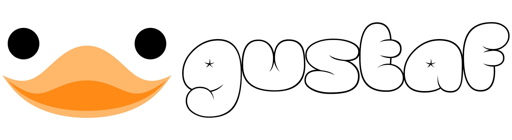
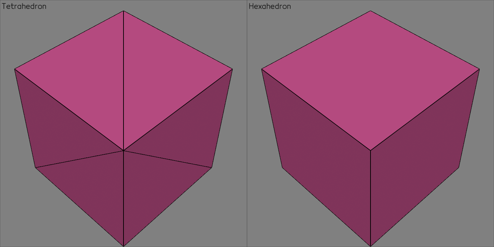

__gustaf__ is a Python library to process and visualize numerical-analysis-geometries;
gustaf currently supports the following elements:
- points,
- lines,
- triangle,
- quadrilateral,
- tetrahedron, and
- hexahedron.

# Installation
`gustaf` only has `numpy` for its strict dependency. The minimal version can be installed using `pip`.
```
pip install gustaf
```
To install all the [optional dependencies](#optional-dependencies) at the same time, you can use:
```
# quotation marks required for some shells
pip install "gustaf[all]"
```
For the latest develop version of gustaf:
```
pip install git+https://github.com/tataratat/gustaf.git@main
```

# Quick Start
This example shows how to create volume elements and plot data on them.
For visualization, gustaf uses [vedo](https://vedo.embl.es) as main backend.

To begin we need to import the needed libraries:

```python
import gustaf as gus
import numpy as np
```
## Create a tetrahedron
Now we create our first volume. It will be just a basic cube. Even here we can
already choose between using a tetrahedron and a hexahedron-based
mesh. The `Volumes` class will use tetrahedrons if the volumes keyword is made
up of a list of 4 elements (defining the corners of the tetrahedron), if 8
elements are in each list hexahedrons are used ([defining the corners of the hexahedron in the correct order](https://tataratat.github.io/gustaf/_generated/gustaf.utils.connec.make_hexa_volumes.html#gustaf.utils.connec.make_hexa_volumes)).
```python
# create tetrahedron mesh using Volumes
# it requires vertices and connectivity info, volumes
tet = gus.Volumes(
    vertices=[
        [0.0, 0.0, 0.0],
        [1.0, 0.0, 0.0],
        [0.0, 1.0, 0.0],
        [1.0, 1.0, 0.0],
        [0.0, 0.0, 1.0],
        [1.0, 0.0, 1.0],
        [0.0, 1.0, 1.0],
        [1.0, 1.0, 1.0],
    ],
    volumes=[
        [0, 2, 7, 3],
        [0, 2, 6, 7],
        [0, 6, 4, 7],
        [5, 0, 4, 7],
        [5, 0, 7, 1],
        [7, 0, 3, 1],
    ],
)

# set line color and width
tet.show_options["lc"] = "black"
tet.show_options["lw"] = 4

tet.show(background="grey")
```

```python
hexa = gus.Volumes(
    vertices=[
        [0.0, 0.0, 0.0],  # 0
        [1.0, 0.0, 0.0],  # 1
        [0.0, 1.0, 0.0],
        [1.0, 1.0, 0.0],  # 3
        [0.0, 0.0, 1.0],
        [1.0, 0.0, 1.0],
        [0.0, 1.0, 1.0],  # 6
        [1.0, 1.0, 1.0],
    ],
    volumes=[
        [0, 1, 3, 2, 4, 5, 7, 6],
    ],
)

hexa.show_options["lc"] = "black"
hexa.show_options["lw"] = 4

hexa.show(background="grey")
```

## Basic visualization

As just shown, it is really easy to show the objects by just calling the
`show()` function on the object. But that is just the beginning of the
possibilities in vedo. You can plot multiple objects next to each other:
```python
# show multiple items in one plot
# each list will be put into a separate subplot.
gus.show(["Tetrahedron", tet], ["Hexahedron", hexa])
```


Now let's add a color map to the object for the norm of the
coordinate, and let us also add at each vertex an arrow with random direction
and length.
```python
# let's visualize some scalar data and vector data defined on vertices
tet.vertex_data["arange"] = np.arange(len(tet.vertices))  # scalar
tet.show_options["data"] = "arange"
tet.vertex_data["random"] = np.random.random(
    (len(tet.vertices), 3)
)  # vector
tet.show_options["arrow_data"] = "random"
tet.show(background="grey")
```


Are you interested in splines?
Please checkout [splinepy](https://tataratat.github.io/splinepy/)!


# Optional Dependencies
| Package | Description |
| ------- | ----------- |
| [numpy](https://numpy.org) | Fast array data operations. |
| [vedo](https://vedo.embl.es) | Default renderer / visualization core of gustaf. |
| [scipy](https://scipy.org) | Create k-d trees and simple rotation matrices.|
| [napf](https://github.com/tataratat/napf) | Fast k-d tree build / query based on nanoflann. Supersedes scipy if it is importable. |
| [funi](https://github.com/tataratat/funi) | A different method to find unique float array rows. But faster than k-d trees! |
| [meshio](https://github.com/nschloe/meshio) | Supports loading/exporting numerous mesh formats. |
